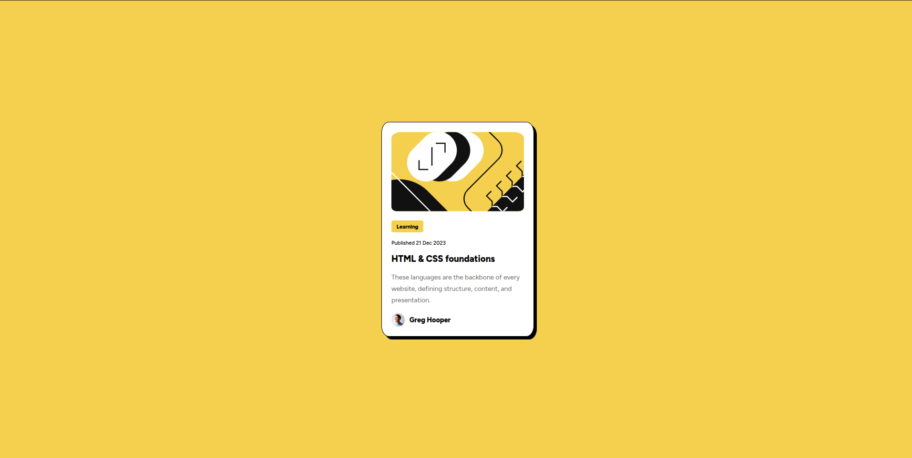

# Frontend Mentor - Blog preview card solution

### Screenshot

### Built with

- Semantic HTML5 markup
- CSS custom properties
- Flexbox
- Mobile-first workflow

### What I learned

I learnt that, I can resize an image by putting it in a div element and hidding the overflow, I don't know if this is the best approach to do it but it worked.

Below is the code I used to resize the image for the mobile view:

html:

      

css:
#image-container {
    overflow: hidden;
    border-radius: 8%;
}

#head-img {
    margin-left: -26px;
}

## Author

Quartey Obed Nii Kpakpa
- Frontend Mentor - [@obkpakpa](https://www.frontendmentor.io/profile/obkpakpa)
